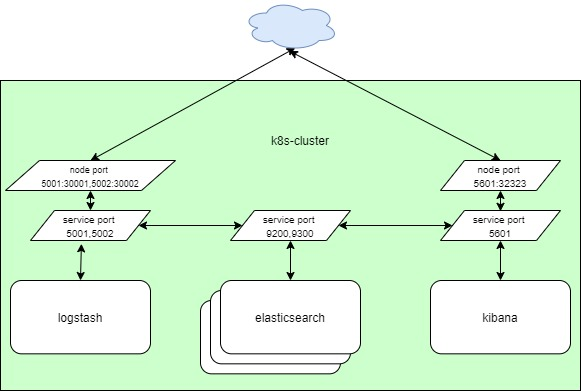

# Install elk on kubernetes

## Helm Version
	# helm version --short
	Client: v2.16.1+gbbdfe5e
	Server: v2.16.1+gbbdfe5e

## Helm repo
	# helm repo list
	NAME    URL
	stable  https://kubernetes-charts.storage.googleapis.com
	local   http://127.0.0.1:8879/charts
	elastic https://Helm.elastic.co

## ELK install
generete value and modify if needed, or user reference in [materials](./materials) folder

	# helm inspect values elastic/elasticsearch > /tmp/elastic.value
	# helm install --name elastic elastic/elasticsearch -f /tmp/elastic.value

	# helm inspect values elastic/kibana > /tmp/kibana.value
	# helm install --name kibana elastic/kibana -f /tmp/kibana.value

	# helm inspect values elastic/logstash > /tmp/logstash.value
	# helm install --name logstash elastic/logstash -f /tmp/logstash.value

## Check connection
	check UDP port
	nc -z -v -u [hostname/IP-address] [port number]

	check TCP port
	nc -z -v [hostname/IP-address] [port number]

	send text to TCP port
	nc [hostname/IP-address] [port number] < teslog-tcp.txt

	send text to TCP port
	nc -u [hostname/IP-address] [port number] < teslog-udp.txt

exemple result

	[root@kmaster elk]# nc -z -v -u 192.168.26.122 30002
	Ncat: Version 7.50 ( https://nmap.org/ncat )
	Ncat: Connected to 192.168.26.122:30002.
	Ncat: UDP packet sent successfully
	Ncat: 1 bytes sent, 0 bytes received in 2.03 seconds.
	[root@kmaster elk]# 
	[root@kmaster elk]# nc -z -v 192.168.26.122 30001
	Ncat: Version 7.50 ( https://nmap.org/ncat )
	Ncat: Connected to 192.168.26.122:30001.
	Ncat: 0 bytes sent, 0 bytes received in 0.02 seconds.
	[root@kmaster elk]#

